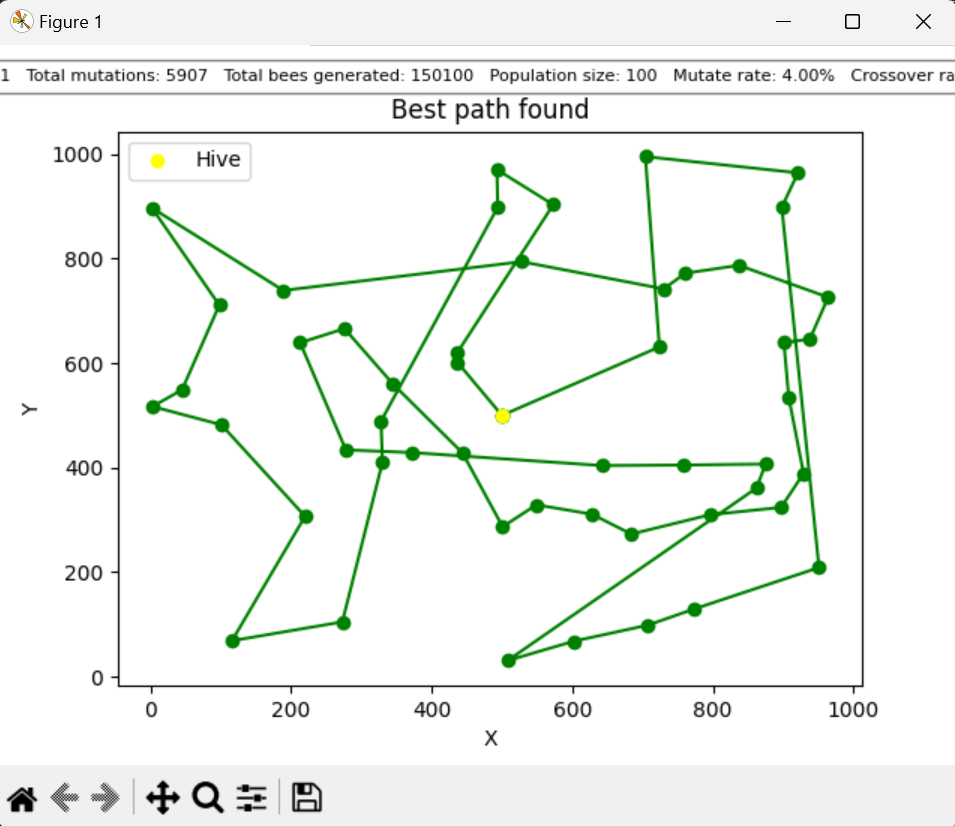

# Simulation d'Abeilles

## Description
Ce projet est une simulation d'abeilles qui utilise un algorithme génétique pour optimiser le chemin de recherche de nectar dans un champ de fleurs. Les abeilles simulent un comportement de recherche de nourriture, cherchant le chemin le plus court à travers un ensemble de fleurs disposées dans un espace donné.

## Technologies utilisées
- **Python** : Langage de programmation principal.
- **Tkinter** : Bibliothèque pour la création d'interfaces graphiques.
- **Matplotlib** : Bibliothèque pour la visualisation des résultats.
- **NumPy** : Pour les opérations mathématiques (si nécessaire).

# Problématique : 

Une ruche d’abeilles est installée dans un champ où il y a 50 fleurs. Les 100 abeilles de cette ruche se demandent quel est le meilleur itinéraire à effectuer pour butiner les 50 fleurs le plus rapidement possible.

# Fonctionnement Fondamental

Le programme utilise une approche basée sur l'algorithme génétique, qui imite le processus naturel de sélection, mutation et reproduction. Voici un aperçu de son fonctionnement :

## 1. Chargement des Fleurs

Les positions des fleurs sont lues à partir d'un fichier texte. Chaque fleur est représentée par ses coordonnées (x, y) dans un plan.

## 2. Classes Principales

### Classe `Bee`

- **Représentation d'une Abeille** : Chaque abeille a un chemin aléatoire à travers les fleurs.
- **Méthodes** :
  - `build_random_path()` : Génère un chemin aléatoire.
  - `calculate_fitness()` : Calcule la distance totale parcourue par l'abeille pour collecter le nectar et retourner à la ruche.
  - `mutate()` : Applique une mutation au chemin en échangeant des fleurs.
  - `crossover()` : Crée un nouveau chemin en combinant deux chemins d'abeilles parentes.

### Classe `Hive`

- **Représentation d'une Ruche** : La classe gère une population d'abeilles et leur évolution.
- **Méthodes** :
  - `evaluate_population()` : Évalue la population et identifie la meilleure abeille.
  - `select_best_bees()` : Sélectionne les meilleures abeilles pour la reproduction.
  - `generate_new_population()` : Crée une nouvelle génération d'abeilles par mutation et croisement.

## 3. Boucle Principale

La simulation est exécutée dans une boucle qui gère plusieurs générations :
- Pour chaque génération, les meilleures abeilles sont sélectionnées et une nouvelle génération est créée par mutation ou croisement.
- La distance parcourue par la meilleure abeille de chaque génération est affichée.
- Les résultats finaux incluent le meilleur chemin trouvé et sa distance totale.

## Méthodes d'Évolution

Le programme utilise plusieurs méthodes pour faire évoluer la population d'abeilles :

### 1. Sélection

Les n meilleures abeilles sont sélectionnées (n = population_rate) en fonction de leur distance parcourue. Cela simule la sélection naturelle, où les individus les plus adaptés sont choisis pour se reproduire.

### 2. Mutation

Chaque abeille a une probabilité de subir une mutation (mutation_rate). Cela implique de modifier son chemin en échangeant n positions de fleurs (n = mutation_intensity). La mutation permet d'explorer de nouveaux chemins et d'éviter de rester coincé dans des solutions sous-optimales.

### 3. Croisement

Le croisement (si 20/100 des abeilles mutent, 80/100 sont croisées) est utilisé pour créer de nouvelles abeilles en combinant les chemins de deux abeilles parentes. Cela permet de combiner les bonnes caractéristiques de deux chemins pour en créer un nouveau qui pourrait être meilleur.

### 4. Évaluation

Chaque génération est évaluée, et n meilleure abeille sont sélectionnées (n = population_rate) pour passer à la génération suivante. Ce processus se répète sur plusieurs générations pour améliorer progressivement les performances des abeilles.

# Solution

Voici les paramètre que nous avons mis en place :

Population Rate 20/100 : Le nombre de meilleurs abbeilles sélectionnées pour les générations suivantes

Mutate rate 4/100 : Nombre d'abbeilles subissant une mutation

Crossover Rate 96/100 : Nombre d'abbeilles subissant un croisement 

Mutation intensity : 2/50 : Nombre de positions modifiées dans le génome

Génération 1500 : Nombre de génération créés avant la fin du programme 

# Résultat 

Nos premières générations ont une distance totale d'environ 24000 . Avec plus de 1000 générations nous avons pu atteindre environ 7500 de distance . 
voici quelque graphique pour illustrer . 

# Analyse complémentaire 

Plus il y à d’aléatoire, plus on observe des variations dans les résultats, moins il y à d’aléatoire, plus on arrive à une stagnation vers un minimum local.

Pour obtenir les meilleurs résultats, il faut maintenir un taux d’aléatoire minimal afin de permettre a l’algorithme de rechercher et transmettre le maximum de solutions sans se heurter à une stagnation trop rapide. 
